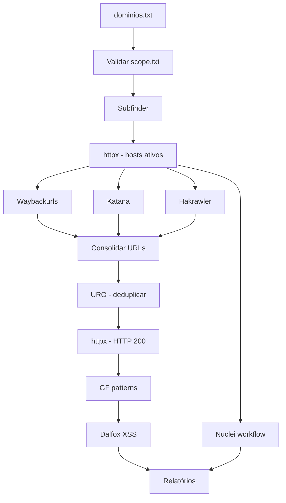

**Pipeline automatizado de reconhecimento web autorizado para Kali Linux.**
Coleta subdomínios, valida hosts ativos, faz crawling, deduplica URLs, classifica padrões de vulnerabilidade e executa varreduras com Dalfox e Nuclei — com relatórios em JSON, CSV e Markdown.

---

## Aviso legal

> Utilize **exclusivamente** em alvos com autorização explícita por escrito.  
> O uso não autorizado é ilegal e pode resultar em consequências civis e criminais.

---

## Scripts do projeto

| Script | Função | Como executar |
|--------|--------|---------------|
| **`install.sh`** | Instala todas as dependências em ambiente isolado | `sudo ./install.sh` |
| **`recon.sh`** | Pipeline completo de reconhecimento | `./recon.sh -l dominios.txt` |
| **`activate-env.sh`** | Ativa venv + PATH + `HTTPX_BIN` | `source ./activate-env.sh` |

### `install.sh` — Instalador único

Executa **tudo automaticamente** em um único comando:

- Pacotes **apt** base (`curl`, `jq`, `golang-go`, `python3-venv`...)
- **tools/bin/** → subfinder, httpx, nuclei, katana, dalfox, waybackurls, hakrawler, gf
- **venv/** → uro (Python)
- GF patterns + templates Nuclei
- Cria arquivos ausentes (`requirements.txt`, `activate-env.sh`, `scope.txt`...)
- Remove **httpx Python** conflitante do venv
- Baixa **httpx ProjectDiscovery** via binário GitHub (nunca linka do PATH)
- Registra ambiente no `.zshrc` e `.bashrc`

```bash
cd /home/kali/recon
chmod +x install.sh
sudo ./install.sh
```

### `recon.sh` — Pipeline principal

| Flag | Descrição |
|------|-----------|
| `-l dominios.txt` | Arquivo com lista de domínios (obrigatório) |
| `--resume` | Retoma do último checkpoint |
| `-h`, `--help` | Exibe ajuda |

```bash
./recon.sh -l dominios.txt
./recon.sh -l dominios.txt --resume
```

Ativa automaticamente `tools/bin`, venv e `HTTPX_BIN` — não precisa de `source` antes.

### `activate-env.sh` — Ambiente isolado

```bash
source ./activate-env.sh
```

Define:

- `PATH` com **tools/bin primeiro** (prioridade sobre venv)
- `HTTPX_BIN=/home/kali/recon/tools/bin/httpx`
- venv Python (uro)
- `HOME` isolado para GF patterns

---

## Requisitos

| Item | Detalhe |
|------|---------|
| SO | **Kali Linux** Rolling |
| Shell | Bash 5+ |
| Privilégios | `root` ou `sudo` (só na instalação) |
| Rede | Internet (GitHub + apt) |
| Disco | ~2 GB |
| VM | Disco local — **não** use OneDrive dentro da VM |

---

## Arquivos do projeto

### Obrigatórios (mínimo para funcionar)

```
recon/
├── install.sh          # Instalador
├── recon.sh            # Pipeline
└── activate-env.sh     # Ambiente (criado pelo install se ausente)
```

### Configuração

```
recon/
├── config/settings.conf    # Threads, timeouts, profundidade...
├── scope.txt               # Allowlist — o que você TEM autorização para testar
├── dominios.txt            # Alvos de entrada (criado na instalação)
├── dominios.txt.example    # Exemplo
└── requirements.txt        # uro (criado pelo install se ausente)
```

### Gerados pelo install.sh / pipeline

```
recon/
├── tools/bin/              # Binários isolados (subfinder, httpx, nuclei...)
├── venv/                   # Python venv (uro)
├── gf-patterns/            # Patterns GF
├── .gf-home/               # HOME isolado para GF
├── .go/                    # Cache Go
├── checkpoints/            # Retomada automática
├── logs/recon.log
├── reports/
│   ├── summary.md
│   ├── json/
│   └── csv/
├── output/                 # Saídas por ferramenta
└── workflows/web-workflow.yaml
```

---

## Instalação completa

### 1. Copiar para o Kali

```bash
mkdir -p /home/kali/recon
# Copie a pasta recon/ inteira para /home/kali/recon/
```

### 2. Instalar (um comando)

```bash
cd /home/kali/recon
chmod +x install.sh recon.sh activate-env.sh
sudo ./install.sh
```

### 3. Verificar

```bash
source ./activate-env.sh

# httpx DEVE ser ProjectDiscovery (não Python)
$HTTPX_BIN -version
# Esperado: [INF] Current Version: v1.9.0

for tool in subfinder httpx waybackurls katana hakrawler uro gf dalfox nuclei jq; do
  if [[ "$tool" == "httpx" ]]; then
    [[ -x "$HTTPX_BIN" ]] && echo "OK: httpx -> $HTTPX_BIN" || echo "FALTANDO: httpx"
  else
    command -v "$tool" && echo "OK: $tool" || echo "FALTANDO: $tool"
  fi
done
```

**10 ferramentas OK** = pronto para usar.

---

## `scope.txt` vs `dominios.txt`

| Arquivo | Função | Pergunta |
|---------|--------|----------|
| **`dominios.txt`** | Entrada do scan (`-l`) | *Por onde começo?* |
| **`scope.txt`** | Allowlist de autorização | *O que posso testar?* |

**dominios.txt** — alvos iniciais:

```text
empresa.com
api.empresa.com
```

**scope.txt** — limite legal/técnico:

```text
empresa.com
*.empresa.com
api.empresa.com
```

Todo host encontrado (subdomínios, URLs) é validado contra `scope.txt`. Fora do escopo = **ignorado**.

---

## Configuração (`config/settings.conf`)

| Parâmetro | Padrão | Descrição |
|-----------|--------|-----------|
| `THREADS` | `50` | Threads paralelas |
| `RATE_LIMIT` | `50` | Requisições/segundo |
| `KATANA_DEPTH` | `5` | Profundidade Katana |
| `HAKRAWLER_DEPTH` | `3` | Profundidade Hakrawler |
| `HTTP_TIMEOUT` | `10` | Timeout HTTP (s) |
| `NUCLEI_SEVERITY` | `low,medium,high,critical` | Severidades Nuclei |
| `SLEEP_BETWEEN_STAGES` | `5` | Pausa entre estágios (s) |

---

## Pipeline



| # | Estágio | Ferramenta | Saída |
|---|---------|------------|-------|
| 1 | Escopo | `scope.txt` | `output/consolidated/domains.txt` |
| 2 | Subdomínios | Subfinder | `output/subfinder/subdomains.txt` |
| 3 | Hosts ativos | httpx (PD) | `output/httpx/hosts_active.txt` |
| 4 | URLs históricas | Waybackurls | `output/wayback/urls.txt` |
| 5 | Crawling | Katana | `output/katana/urls.txt` |
| 6 | Crawling | Hakrawler | `output/hakrawler/urls.txt` |
| 7 | Consolidação | — | `output/consolidated/all_urls.txt` |
| 8 | Deduplicação | URO | `output/uro/urls_deduped.txt` |
| 9 | HTTP 200 | httpx (PD) | `output/httpx/urls_200.txt` |
| 10 | Padrões | GF | `output/gf/{xss,sqli,lfi,ssrf,redirect,rce}.txt` |
| 11 | XSS | Dalfox | `output/dalfox/dalfox_results.json` |
| 12 | Varredura | Nuclei | `output/nuclei/nuclei.jsonl` |
| 13 | Relatórios | jq | `reports/summary.md` |

**GF:** `xss` · `sqli` · `lfi` · `ssrf` · `redirect` · `rce`

**Nuclei workflow** (`workflows/web-workflow.yaml`): technologies, exposures, misconfigurations, CVEs, takeovers.

---

## Relatórios

| Tipo | Arquivo | Conteúdo |
|------|---------|----------|
| Markdown | `reports/summary.md` | Relatório executivo |
| JSON | `reports/json/subfinder.json` | Subdomínios |
| JSON | `reports/json/httpx_hosts.json` | Hosts ativos |
| JSON | `reports/json/httpx_urls.json` | URLs HTTP 200 |
| JSON | `reports/json/katana.jsonl` | URLs Katana |
| JSON | `reports/json/nuclei.jsonl` | Achados Nuclei |
| CSV | `reports/csv/hosts.csv` | Hosts + status + tech |
| CSV | `reports/csv/urls.csv` | URLs validadas |
| CSV | `reports/csv/nuclei_findings.csv` | Achados por severidade |
| Log | `logs/recon.log` | Execução completa |

---

## Checkpoints (`--resume`)

```
checkpoints/.domains.done
checkpoints/.subfinder.done
checkpoints/.httpx_hosts.done
checkpoints/.waybackurls.done
checkpoints/.katana.done
checkpoints/.hakrawler.done
checkpoints/.consolidate.done
checkpoints/.uro.done
checkpoints/.httpx_urls.done
checkpoints/.gf_patterns.done
checkpoints/.dalfox.done
checkpoints/.nuclei.done
checkpoints/.reports.done
```

```bash
# Reexecutar só o estágio httpx_hosts
rm -f checkpoints/.httpx_hosts.done
./recon.sh -l dominios.txt --resume
```

---

## Ambiente isolado

| Componente | Local | Ferramenta |
|------------|-------|------------|
| Binários PD/Go | `tools/bin/` | subfinder, **httpx**, nuclei, katana, dalfox, waybackurls, hakrawler, gf |
| Python venv | `venv/` | uro |
| GF patterns | `gf-patterns/` + `.gf-home/` | gf |
| Cache Go | `.go/` | go install |

### Conflito httpx Python vs ProjectDiscovery

Existem **dois pacotes** com o mesmo nome:

| | httpx Python (pip) | httpx ProjectDiscovery |
|---|-------------------|------------------------|
| Uso | Cliente HTTP Python | Scanner de hosts/URLs |
| `-l` | Não existe | Existe |
| `-version` | Erro `-e` | `[INF] Current Version: v1.9.0` |
| Local correto | ~~venv/bin/httpx~~ (removido) | **tools/bin/httpx** |

O projeto usa `HTTPX_BIN` apontando sempre para `tools/bin/httpx`.

---

## Solução de problemas

### httpx errado (`No such option: -l`)

```bash
cd /home/kali/recon
rm -f tools/bin/httpx venv/bin/httpx

curl -fsSL -o /tmp/httpx.zip \
  https://github.com/projectdiscovery/httpx/releases/download/v1.9.0/httpx_1.9.0_linux_amd64.zip
unzip -o /tmp/httpx.zip -d /tmp
chmod +x /tmp/httpx
mv /tmp/httpx tools/bin/httpx

tools/bin/httpx -version   # deve mostrar v1.9.0
source ./activate-env.sh
```

Ou reinstale tudo: `sudo ./install.sh`

### `Unable to locate package httpx` no apt

Normal no Kali — o `install.sh` baixa via GitHub, não usa apt para httpx.

### Erro `httpx_hosts` no pipeline

```bash
rm -f checkpoints/.httpx_hosts.done
./recon.sh -l dominios.txt --resume
tail -30 logs/recon.log
```

### uro ou dalfox faltando

```bash
sudo ./install.sh
# ou manualmente:
source venv/bin/activate && pip install uro
curl -fsSL -o /tmp/dalfox.tar.gz \
  https://github.com/hahwul/dalfox/releases/download/v2.13.0/dalfox-linux-amd64.tar.gz
tar xzf /tmp/dalfox.tar.gz -C /tmp && mv /tmp/dalfox tools/bin/
```

### CRLF (copiou do Windows)

```bash
sed -i 's/\r$//' install.sh recon.sh activate-env.sh
```

### VM no OneDrive

Mova a VM para `C:\VMs\` — OneDrive corrompe discos `.vmdk`.

### Reinstalar do zero

```bash
cd /home/kali/recon
rm -rf tools/ venv/ .go/ .gf-home/ gf-patterns/ checkpoints/ output/ logs/ reports/
sudo ./install.sh
```

---

## Referência rápida

```bash
# ── INSTALAÇÃO ──
sudo ./install.sh

# ── AMBIENTE ──
source ./activate-env.sh

# ── CONFIGURAR ALVOS ──
nano scope.txt
nano dominios.txt

# ── EXECUTAR ──
./recon.sh -l dominios.txt
./recon.sh -l dominios.txt --resume

# ── MONITORAR ──
tail -f logs/recon.log
cat reports/summary.md

# ── VALIDAR HTTPX ──
$HTTPX_BIN -version
$HTTPX_BIN -l dominios.txt -silent -status-code
```

---

## Versões das ferramentas instaladas

| Ferramenta | Método | Versão |
|------------|--------|--------|
| httpx | Binário GitHub | v1.9.0 |
| katana | Binário GitHub | v1.6.1 |
| dalfox | Binário GitHub | v2.13.0 |
| subfinder | go install / binário | latest |
| nuclei | go install / binário | latest |
| uro | pip (venv) | ≥1.0.2 |
| waybackurls, hakrawler, gf | go install | latest |

---

## Licença e responsabilidade

Ferramenta para **testes de segurança autorizados** e **Bug Bounty** dentro de escopo definido. O autor não se responsabiliza pelo uso indevido.

---

<p align="center">
  <strong>recon.sh v1.1.0</strong> · Kali Linux · Bash 5+<br>
  install.sh · recon.sh · activate-env.sh
</p>
